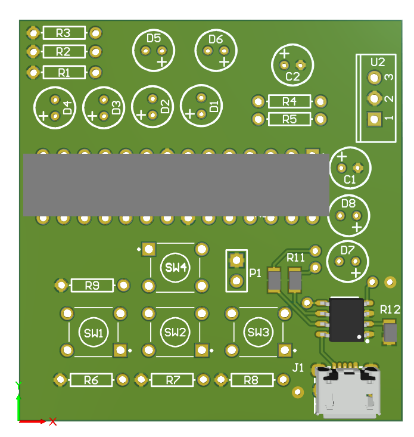

# Universal TV Remote

This project is an attempt to create a universal TV remote that can capture IR signals from any remote, store them, and retransmit them. It allows you to control multiple IR devices using a single custom controller.

# Features

* Capture, store, and transmit IR signals
* USB Micro charging port
* Store up to 16 IR signals
* Signal selection via 2 buttons
* Binary LED counter indicates selected signal
